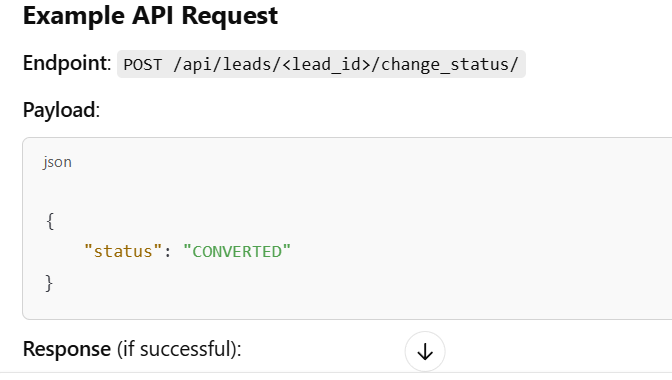

# Lead Management
GET     /lead/restaurants/                  - List all leads

POST    /lead/restaurants/                  - Create new lead
payload 
{
    "name": "The Great Restaurant",
    "address": "123 Food Street",
    "city": "New York",
    "state": "New York",
    "pincode": "10001",
    "contact_person": "John Doe",
    "phone": "+1234567890",
    "email": "johndoe@example.com",
    "lead_status": "NEW",
    "potential_revenue": 5000.00,
    "notes": "Interested in premium features.",
    "assigned_to": 1
}

GET     /lead/restaurants/{id}/            - Get single lead
PUT     /lead/restaurants/{id}/            - Update lead
DELETE  /lead/restaurants/{id}/            - Delete lead

POST    /lead/restaurants/{id}/change_status/  - Change lead status
{
    "status": "CONTACTED"
}

GET     /lead/restaurants/{id}/status_history/ - Get status history

