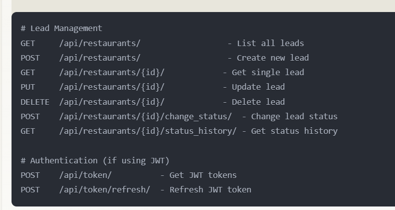
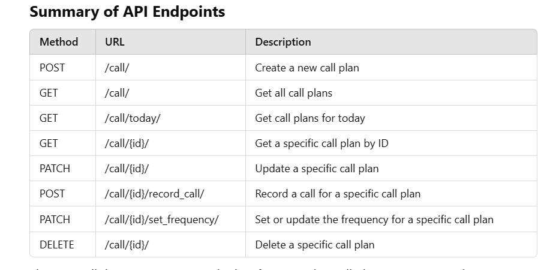

# Lead Management
GET     /lead/restaurants/                  - List all leads
POST    /lead/restaurants/                  - Create new lead
GET     /lead/restaurants/{id}/            - Get single lead
PUT     /lead/restaurants/{id}/            - Update lead
DELETE  /lead/restaurants/{id}/            - Delete lead
POST    /lead/restaurants/{id}/change_status/  - Change lead status
GET     /lead/restaurants/{id}/status_history/ - Get status history

# Authentication (if using JWT)
POST    /api/token/          - Get JWT tokens
POST    /api/token/refresh/  - Refresh JWT token


# Contact Management 


Here are the APIs for the `contact` app with their corresponding URLs and payloads:

### 1. **Create Contact**
- **URL**: `/contact/contacts/`
- **Method**: `POST`
- **Payload**:
  ```json
  {
    "restaurant": 1,
    "name": "John Doe",
    "role": "Manager",
    "email": "john.doe@example.com",
    "phone": "123-456-7890",
    "address": "123 Street, City, Country"
  }
  ```

### 2. **List Contacts**
- **URL**: `/contact/contacts/`
- **Method**: `GET`
- **Payload**: None (Returns a list of contacts)

Example response:
```json
[
    {
        "id": 1,
        "restaurant": 1,
        "name": "John Doe",
        "role": "Manager",
        "email": "john.doe@example.com",
        "phone": "123-456-7890",
        "address": "123 Street, City, Country"
    }
]
```

### 3. **Retrieve Contact by ID**
- **URL**: `/api/contacts/{id}/`
- **Method**: `GET`
- **Payload**: None (Returns the details of the contact with the given ID)

Example response:
```json
{
    "id": 1,
    "restaurant": 1,
    "name": "John Doe",
    "role": "Manager",
    "email": "john.doe@example.com",
    "phone": "123-456-7890",
    "address": "123 Street, City, Country"
}
```

### 4. **Update Contact**
- **URL**: `/api/contacts/{id}/`
- **Method**: `PUT`
- **Payload**:
  ```json
  {
    "restaurant": 1,
    "name": "John Smith",
    "role": "Head Manager",
    "email": "john.smith@example.com",
    "phone": "987-654-3210",
    "address": "456 Avenue, City, Country"
  }
  ```

### 5. **Delete Contact**
- **URL**: `/api/contacts/{id}/`
- **Method**: `DELETE`
- **Payload**: None (Deletes the contact with the given ID)

# in place of api use contact


3. Interaction Tracking 

## **General Interactions APIs**

### **1. Create a New Interaction**
- **Endpoint**:  
  ```http
  POST /track/interactions/
  ```
- **Purpose**:  
  Record a new interaction between a lead and a contact.

- **Payload**:
  ```json
  {
      "lead": 2,
      "contact": 3,
      "interaction_type": "CALL",
      "details": "Followed up on last week's discussion.",
      "order_placed": false,
      "date": "2024-12-24T15:30:00Z"
  }
  ```

- **Example Response**:
  ```json
  {
      "id": 1,
      "lead": 2,
      "contact": 3,
      "interaction_type": "CALL",
      "details": "Followed up on last week's discussion.",
      "order_placed": false,
      "date": "2024-12-24T15:30:00Z"
  }
  ```

---

### **2. List All Interactions**
- **Endpoint**:  
  ```http
  GET /track/interactions/
  ```
- **Purpose**:  
  Retrieve all recorded interactions, optionally filtered by `lead` or `contact`.

- **Filters**:
  - `?lead=<lead_id>`: Filter interactions for a specific lead.
  - `?contact=<contact_id>`: Filter interactions for a specific contact.

- **Example Request**:
  ```http
  GET /track/interactions/?lead=2
  ```

- **Example Response**:
  ```json
  [
      {
          "id": 1,
          "lead": 2,
          "contact": 3,
          "interaction_type": "CALL",
          "details": "Followed up on last week's discussion.",
          "order_placed": false,
          "date": "2024-12-24T15:30:00Z"
      },
      {
          "id": 2,
          "lead": 2,
          "contact": 4,
          "interaction_type": "EMAIL",
          "details": "Sent product catalog.",
          "order_placed": false,
          "date": "2024-12-25T10:00:00Z"
      }
  ]
  ```

---

### **3. Retrieve a Specific Interaction**
- **Endpoint**:  
  ```http
  GET /track/interactions/<interaction_id>/
  ```
- **Purpose**:  
  Fetch details of a specific interaction by its `id`.

- **Example Request**:
  ```http
  GET /track/interactions/1/
  ```

- **Example Response**:
  ```json
  {
      "id": 1,
      "lead": 2,
      "contact": 3,
      "interaction_type": "CALL",
      "details": "Followed up on last week's discussion.",
      "order_placed": false,
      "date": "2024-12-24T15:30:00Z"
  }
  ```

---

### **4. Update an Interaction**
- **Endpoint**:  
  ```http
  PATCH /track/interactions/<interaction_id>/
  ```
- **Purpose**:  
  Modify an existing interaction (e.g., update interaction type, details, or date).

- **Payload**:
  ```json
  {
      "details": "Confirmed product interest."
  }
  ```

- **Example Response**:
  ```json
  {
      "id": 1,
      "lead": 2,
      "contact": 3,
      "interaction_type": "CALL",
      "details": "Confirmed product interest.",
      "order_placed": false,
      "date": "2024-12-24T15:30:00Z"
  }
  ```

---

### **5. Delete an Interaction**
- **Endpoint**:  
  ```http
  DELETE /track/interactions/<interaction_id>/
  ```
- **Purpose**:  
  Delete a specific interaction.

- **Example Request**:
  ```http
  DELETE /track/interactions/1/
  ```

- **Example Response**:
  ```json
  {
      "message": "Interaction deleted successfully."
  }
  ```

---

## **Order-Specific APIs**

### **6. List Order-Specific Interactions**
- **Endpoint**:  
  ```http
  GET /track/interactions/orders/
  ```
- **Purpose**:  
  Retrieve interactions where orders were placed (`order_placed=true`).

- **Filters**:
  - `?lead=<lead_id>`: Filter by a specific lead.

- **Example Request**:
  ```http
  GET /track/interactions/orders/?lead=2
  ```

- **Example Response**:
  ```json
  [
      {
          "id": 3,
          "lead": 2,
          "contact": 5,
          "interaction_type": "ORDER",
          "details": "Placed an order for 50 units of product A.",
          "order_placed": true,
          "date": "2024-12-25T12:00:00Z"
      }
  ]
  ```

---

### **7. Retrieve Order Details (Optional, if using `Order` Model)**
If using the `Order` model, this API fetches detailed order information linked to an interaction.

- **Endpoint**:  
  ```http
  GET /track/interactions/<interaction_id>/order_details/
  ```
- **Purpose**:  
  Retrieve specific order details for an interaction.

- **Example Response**:
  ```json
  {
      "product_details": "50 units of Product A",
      "quantity": 50,
      "total_price": 500.00,
      "order_date": "2024-12-25T12:00:00Z"
  }
```

4. Call Planning 

Here are all the APIs for the **Call Planning** feature with the corresponding payloads. The endpoints are structured as follows:

### **1. Create a New Call Plan (POST /call/)**
- **URL**: `http://127.0.0.1:8000/call/`
- **Method**: `POST`
- **Description**: This endpoint allows you to create a new call plan for a lead.
- **Payload**:

```json
{
  "lead": 1,                     // ID of the lead (Restaurant instance)
  "frequency": "DAILY",          // Frequency: "DAILY", "WEEKLY", "BIWEEKLY", "MONTHLY"
  "notes": "Initial call plan."  // Notes (optional)
}
```

- **Response** (Success):

```json
{
  "id": 1,
  "lead": 1,
  "frequency": "DAILY",
  "last_called": null,
  "next_call_date": "2024-12-29T00:00:00Z",
  "notes": "Initial call plan."
}
```

---

### **2. Get All Call Plans (GET /call/)**
- **URL**: `http://127.0.0.1:8000/call/`
- **Method**: `GET`
- **Description**: Fetches a list of all call plans.
- **Response**:

```json
[
  {
    "id": 1,
    "lead": 1,
    "frequency": "DAILY",
    "last_called": null,
    "next_call_date": "2024-12-29T00:00:00Z",
    "notes": "Initial call plan."
  },
  {
    "id": 2,
    "lead": 2,
    "frequency": "WEEKLY",
    "last_called": "2024-12-25T15:00:00Z",
    "next_call_date": "2024-12-31T15:00:00Z",
    "notes": "Follow-up call plan."
  }
]
```

---

### **3. Get Call Plans Requiring a Call Today (GET /call/today/)**
- **URL**: `http://127.0.0.1:8000/call/today/`
- **Method**: `GET`
- **Description**: Fetches the list of call plans whose `next_call_date` matches today's date.
- **Response**:

```json
[
  {
    "id": 1,
    "lead": 1,
    "frequency": "DAILY",
    "last_called": null,
    "next_call_date": "2024-12-28T00:00:00Z",
    "notes": "Initial call plan."
  }
]
```

---

### **4. Get a Specific Call Plan (GET /call/{id}/)**
- **URL**: `http://127.0.0.1:8000/call/{id}/`
- **Method**: `GET`
- **Description**: Fetches the details of a specific call plan using its ID.
- **Response**:

```json
{
  "id": 1,
  "lead": 1,
  "frequency": "DAILY",
  "last_called": null,
  "next_call_date": "2024-12-29T00:00:00Z",
  "notes": "Initial call plan."
}
```

---

### **5. Update a Call Plan (PATCH /call/{id}/)**
- **URL**: `http://127.0.0.1:8000/call/{id}/`
- **Method**: `PATCH`
- **Description**: Allows you to update the details of a specific call plan, such as frequency, last called, or notes.
- **Payload**:

```json
{
  "frequency": "WEEKLY",        // New frequency, if updating
  "notes": "Updated call plan." // Updated notes
}
```

- **Response** (Success):

```json
{
  "id": 1,
  "lead": 1,
  "frequency": "WEEKLY",
  "last_called": null,
  "next_call_date": "2024-12-29T00:00:00Z",
  "notes": "Updated call plan."
}
```

---

### **6. Record a Call (POST /call/{id}/record_call/)**
- **URL**: `http://127.0.0.1:8000/call/{id}/record_call/`
- **Method**: `POST`
- **Description**: This endpoint records the last call made for the given `CallPlan` and updates the `next_call_date` based on the frequency.
- **Payload**:

```json
{
  "last_called": "2024-12-28T10:00:00Z"  // Timestamp of when the call was made
}
```

- **Response**:

```json
{
  "id": 1,
  "lead": 1,
  "frequency": "DAILY",
  "last_called": "2024-12-28T10:00:00Z",
  "next_call_date": "2024-12-29T10:00:00Z",
  "notes": "Initial call plan."
}
```

---

### **7. Set or Update Frequency for a Call Plan (PATCH /call/{id}/set_frequency/)**
- **URL**: `http://127.0.0.1:8000/call/{id}/set_frequency/`
- **Method**: `PATCH`
- **Description**: This endpoint allows you to set or update the call frequency for a given `CallPlan`.
- **Payload**:

```json
{
  "frequency": "WEEKLY"  // New frequency to set
}
```

- **Response**:

```json
{
  "id": 1,
  "lead": 1,
  "frequency": "WEEKLY",
  "last_called": "2024-12-28T10:00:00Z",
  "next_call_date": "2025-01-04T10:00:00Z",
  "notes": "Updated call plan."
}
```

---

### **8. Delete a Call Plan (DELETE /call/{id}/)**
- **URL**: `http://127.0.0.1:8000/call/{id}/`
- **Method**: `DELETE`
- **Description**: This endpoint deletes a specific call plan based on the provided `id`.
- **Response** (Success):

```json
{
  "detail": "Successfully deleted the call plan."
}
```

---

### **Summary of API Endpoints**


